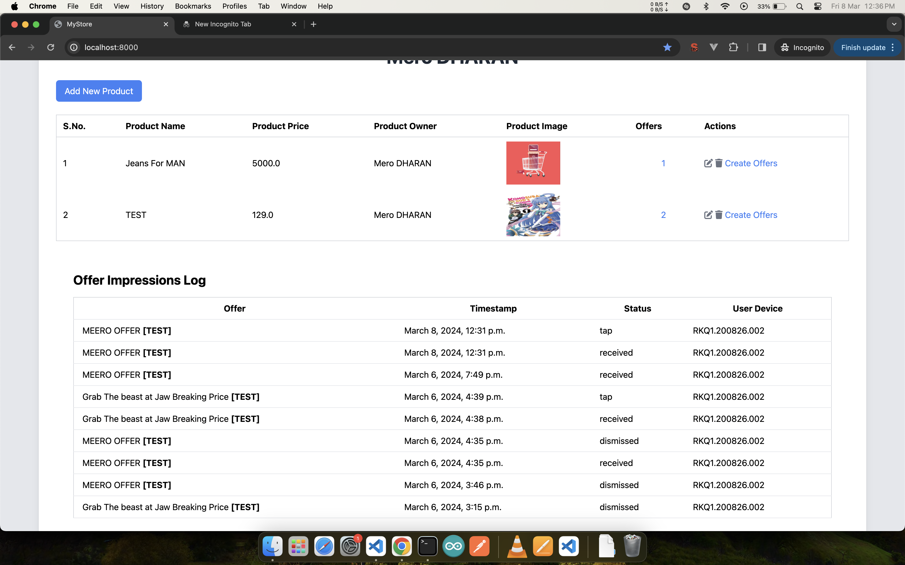

# Web App for Geolocation Based Offer Recommendation

## Description

This is intented for educational uses only and not for commercial usage

## Table of Contents (Optional)

- [Installation](#installation)

## Installation (REQUIRED )

Go to repo folder

```bash
cd fencealert
```

Firstly create new Python virtual environment using

```bash
python -m venv myenv
```

# Activate that environment

For windows

```bash
myenv\Scripts\activate
```

For Linux

```bash
myenv/bin/activate
```

After the successful activation you can see (myenv) infornt of every terminal cmd change directory to project directory(directory where manage.py file resides)

## Dependency Install

We need to install django and other dependencies\
here we have requirements.txt file with is list of all required dependencies\
Run

```bash
pip install -r requirements.txt
```

change directory to project directory to run migrations and server

```bash
python manage.py makemigrations
```

```bash
python manage.py migrate
```

and then finally

```bash
python manage.py runserver 0.0.0.0:8000
```

- Make sure to run the server with 0.0.0.0:8000 to enable it to be accessible on the network otherwise the App will not be able to communicate with this server
- PS. use ifconfig command to view the ip address of your device

```bash
ifconfig
```

```bash
ipconfig
```

## SCREENSHOTS

<!--  -->




<!--  -->
